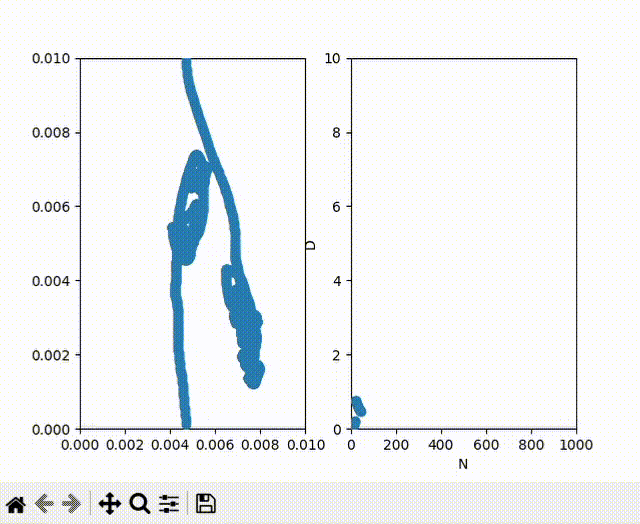

# Diffusion Simulation

## Overview
This project simulates the diffusion of particles in air using a particle-based physics model. The simulation tracks the movement and collisions of molecule of interest and air molecules in a 2D space, visualizing the random walk behavior and calculating diffusion coefficients.

## Class Descriptions

### `Particle` (air_cl.py)
- Base class for all particles in the simulation
- Contains core properties: mass, coordinates, velocity, size
- Implements collision physics and boundary handling
- Provides basic movement and position updating functionality

### `Air` (air_cl.py)
- Inherits from `Particle`
- Represents air molecules (modeled as nitrogen)
- Implements specific mass for air molecules
- Handles initialization and velocity scaling

### `Helium` (helium_cl.py)
- Inherits from `Particle`
- Represents helium particles
- Implements specific mass for helium
- Provides tracking functionality for monitoring position
- The properties may be changed for other substances

### `Space` (space_cl.py)
- Manages the simulation environment
- Handles creation and updating of all particles
- Implements Maxwell-Boltzmann velocity distribution
- Tracks collisions and calculates diffusion metrics
- Maintains boundary conditions

### `func.py`
- Contains physics helper functions
- Implements Maxwell-Boltzmann distribution calculations
- Provides distance and velocity utilities

## Modeling Process

### Collision Physics
1. When particles come within a threshold distance (0.0005 units), a collision is triggered
2. Collisions use momentum conservation principles:
   - Total system momentum is calculated
   - Momentum is redistributed based on mass ratios
   - Velocities are updated accordingly

### Particle Movement
1. Particles move according to their assigned velocities
2. Periodic boundary conditions are implemented:
   - Particles exiting one side reappear on the opposite side
   - This maintains constant particle count while simulating infinite space

### Velocity Distribution
1. Air molecule velocities follow Maxwell-Boltzmann distribution
2. Velocities are scaled to appropriate magnitudes for visualization
3. Random directional components are assigned

### Diffusion Tracking
1. The simulation tracks positions of the particle of interest over time
2. Mean squared displacement is calculated
3. Diffusion coefficient is derived from the provided data

### Visualization
1. Main animation shows:
   - Air molecules as blue points
   - Particle of interest as red point
   - Particle of interest trajectory path
   - Diffusion coefficient evolution over time

The simulation provides insights into microscopic gas behavior and demonstrates how macroscopic phenomena like diffusion emerge from particle-level interactions.
